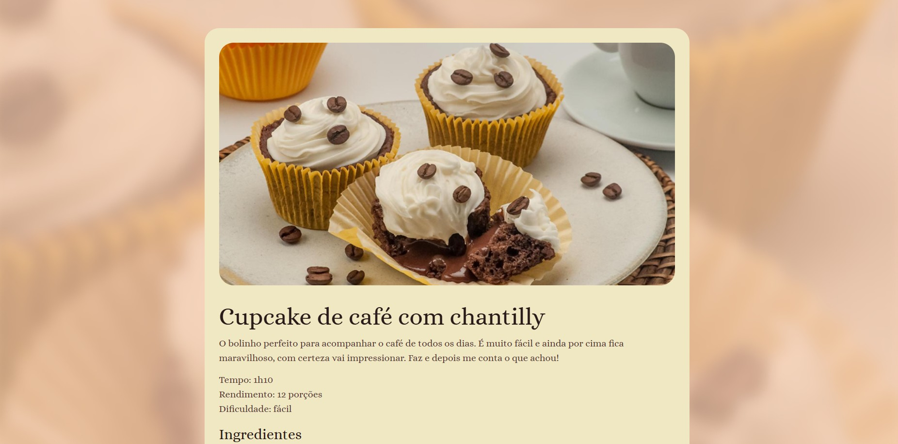

# Página de Receita – Projeto Rocketseat

Uma página de receita desenvolvida com **HTML** e **CSS**, como parte de um desafio proposto pela **Rocketseat**.

🔗 [Acesse o projeto online](https://lagantunes.github.io/Pagina-de-receita---Projeto-Rocktseat/)

## 🧾 Sobre o projeto

O projeto tem como objetivo praticar a estruturação de páginas web utilizando HTML semântico e estilização com CSS.  
Trata-se de uma página simples que apresenta uma receita culinária de forma visualmente agradável.

## 🛠 Tecnologias utilizadas

- HTML5  
- CSS3

## ✍️ Autor

Desenvolvido por [**@lagantunes**](https://github.com/lagantunes)
